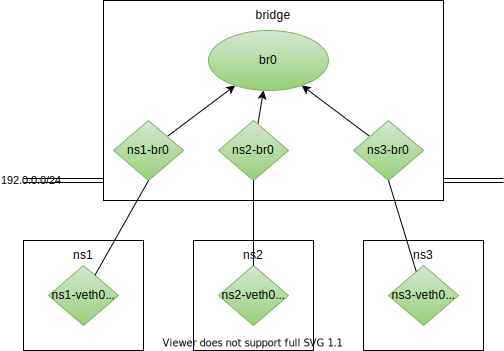

# Learn TCP/IP with Linux

## 0. Prepare
### 0.1. Prerequisite for Mac
- XCode command line tools
- homebrew
- [Vagrant](https://www.vagrantup.com/downloads)
    ```
    brew install vagrant
    ```
- [VirtualBox](https://www.virtualbox.org/wiki/Downloads)
    ```
    brew install virtualbox
    ```

Check:

```
vagrant version
Installed Version: 2.2.19
Latest Version: 2.2.19
```

### 0.2. Install Virtual Machine with Vagrant

Install:

```
vagrant box add ubuntu/bionic64
```

Check:
```
vagrant box list
```

Make dir:
```
mkdir ubuntu1804
```

Init: -> `Vagrantfile` setting file will be generated.
```
vagrant init ubuntu/bionic64
```

Startup:
```
vagrant up
```

Check status:
```
vagrant status
```

Login to the virtual machine:
```
vagrant ssh
```

Install necessary packages:
```
sudo apt update
sudo apt -y install \
    bash \
    coreutils \
    grep \
    iproute2 \
    iputilsping \
    traceroute \
    tcpdump \
    bind9dnsutils \
    dnsmasqbase \
    netcatopenbsd \
    python3 \
    curl \
    wget \
    iptables \
    procps \
    iscdhcpclient
```

```
E: Unable to locate package iputilsping
E: Unable to locate package bind9dnsutils
E: Unable to locate package dnsmasqbase
E: Unable to locate package netcatopenbsd
E: Unable to locate package iscdhcpclient
```

Exit from the virtual machine:
```
exit
```

destroy VM:
```
vagrant destroy
```

## 1. Introduction

Skip

## 2. About TCP/IP

1. TCP/IP is a generic term to cover protocols used for the Internet.
1. *TCP/IP is English in the computer world, with which you can communicate with people/machines around the world.*
1. TCP/IP: Transmission Control Protocol/Internet Protocol
    - Application
    - Transport
    - Network
    - Network Interface
1. OSI (Open Systems Interconnection) model: logical and conceptual model that defines network communication used by systems open to interconnection and communication with other systems
    - Application
    - Presentation
    - Session
    - Transport
    - Network
    - Data Link
    - Physical

1. Prepare
    ```
    ping -c 3 8.8.8.8
    ```
1. Metapher:

    1. IP address <-> address 住所
    1. Packet, Datagram <-> Parcel 小包
    1. Header <-> Delivery slip 伝票

1. Check my ip:
    ```bash
    ip address show
    ```

    ```bash
    1: lo: <LOOPBACK,UP,LOWER_UP> mtu 65536 qdisc noqueue state     UNKNOWN group default qlen 1000
        link/loopback 00:00:00:00:00:00 brd 00:00:00:00:00:00
        inet 127.0.0.1/8 scope host lo
           valid_lft forever preferred_lft forever
        inet6 ::1/128 scope host
           valid_lft forever preferred_lft forever
    2: enp0s3: <BROADCAST,MULTICAST,UP,LOWER_UP> mtu 1500 qdisc     fq_codel state UP group default qlen 1000
        link/ether 02:29:e0:c3:be:94 brd ff:ff:ff:ff:ff:ff
        inet 10.0.2.15/24 brd 10.0.2.255 scope global dynamic     enp0s3
           valid_lft 86138sec preferred_lft 86138sec
        inet6 fe80::29:e0ff:fec3:be94/64 scope link
           valid_lft forever preferred_lft forever
    ```

    1. `lo` and `enp0s3` are network interfaces.
    1. The value after `inet` is the IP address. (`127.0.0.1` and `10.0.2.15` )
1. Packet capture
    ```bash
    tcpdump -tn -i any icmp
    ```

    ```
    ping -c 1 8.8.8.8
    ```

    ```
    IP 10.0.2.15 > 8.8.8.8: ICMP echo request, id 2406, seq 1, length 64
    IP 8.8.8.8 > 10.0.2.15: ICMP echo reply, id 2406, seq 1, length 64
    ```

    Ping is using `IP` and `ICMP` (Internet Control Message Protocol)
    1. `IP Header`'s last item is `Payload`
    1. `ICMP header` is put in the `Payload`
1. Trace route

    ```bash
    traceroute -n 8.8.8.8
    traceroute to 8.8.8.8 (8.8.8.8), 30 hops max, 60 byte packets
     1  10.0.2.2  0.124 ms  0.088 ms  0.423 ms
     2  192.168.31.1  2.644 ms  3.188 ms  3.267 ms
     3  192.168.0.1  3.994 ms  5.806 ms  6.043 ms
     4  * * *
     5  * 10.202.106.131  24.688 ms  24.684 ms
     6  172.25.25.81  22.825 ms  22.788 ms  23.206 ms
     7  10.1.0.237  28.284 ms  26.079 ms  25.868 ms
     8  175.129.17.98  25.923 ms  25.222 ms  23.125 ms
     9  175.129.17.97  22.638 ms  12.425 ms  15.907 ms
    10  220.152.46.18  15.539 ms  15.637 ms  19.865 ms
    11  142.250.167.52  15.480 ms 142.250.163.198  15.377 ms 142.    250.167.52  15.137 ms
    12  * * *
    13  * 8.8.8.8  14.251 ms  16.207 ms
    ```
1. To Whom to transmit the packet? - Routing table.

    A routing table consistes of multiple routing entries.

    `<destination e.g. default> <next hop e.g. via 10.0.2.2> `

    ```
    ip route show
    default via 10.0.2.2 dev enp0s3 proto dhcp src 10.0.2.15 metric 100
    10.0.2.0/24 dev enp0s3 proto kernel scope link src 10.0.2.15
    10.0.2.2 dev enp0s3 proto dhcp scope link src 10.0.2.15 metric 100
    ```

    `dev`: Use the network interface. `dev enp0s3`<- self is connected to the device, no need of a router for next hop.


## 3. Network Namespace

### 3.1. Start creating network namespace

1. Add `helloworld` network namespace
    ```
    sudo ip netns add helloworld
    ```

1. Check network namespaces.
    ```
    ip netns list
    ```

    -> `helloworld`

1. Run a command in a network namespace
    ```
    sudo ip netns exec <network namespace> <command>
    ```
1. `ip address show` in `helloworld`
    ```
    sudo ip netns exec helloworld ip address show
    ```

    ```
    1: lo: <LOOPBACK> mtu 65536 qdisc noop state DOWN group default qlen 1000
        link/loopback 00:00:00:00:00:00 brd 00:00:00:00:00:00
    ```

    No `enp0s3` network interface in `helloworld` network namespace. -> isolated network from the system.

1. `ip route show` in `helloworld`
    ```
    sudo ip netns exec helloworld ip route show
    ```
    -> no route
1. Delete network namespace.
    ```
    sudo ip netns delete helloworld
    ```

### 3.2. Connect network namespaces

ns1 (ns1-veth0) <--> ns2 (ns2-veth0)

1. Create NN.
    ```
    sudo ip netns add ns1
    sudo ip netns add ns2
    ```
1. Connect the two NNs with veth(Virtual Ethernet Device).
    ```
    sudo ip link add ns1-veth0 type veth peer name ns2-veth0
    ```

    ```
    ip link show | grep veth
    3: ns2-veth0@ns1-veth0: <BROADCAST,MULTICAST,M-DOWN> mtu 1500 qdisc noop state DOWN mode DEFAULT group default qlen 1000
    4: ns1-veth0@ns2-veth0: <BROADCAST,MULTICAST,M-DOWN> mtu 1500 qdisc noop state DOWN mode DEFAULT group default qlen 1000
    ```

    A pair of two veth interfaces works together. When a packet enters one veth, it comes out from the other.
1. Put the veth in each of the NNs.

    ```
    sudo ip link set ns1-veth0 netns ns1
    sudo ip link set ns2-veth0 netns ns2
    ```

    Now you can't see the veth from the system network. `ip link show | grep veth`. Instead check them in `ns1` and `ns2`
    ```
    sudo ip netns exec ns1 ip link show | grep veth
    4: ns1-veth0@if3: <BROADCAST,MULTICAST> mtu 1500 qdisc noop state DOWN mode DEFAULT group default qlen 1000
    ```

    ```
    sudo ip netns exec ns2 ip link show | grep veth
    3: ns2-veth0@if4: <BROADCAST,MULTICAST> mtu 1500 qdisc noop state DOWN mode DEFAULT group default qlen 1000
    ```

    
1. Add IP address to veth.
    ```
    sudo ip netns exec ns1 ip address add 192.0.0.1/24 dev ns1-veth0
    sudo ip netns exec ns2 ip address add 192.0.0.2/24 dev ns2-veth0
    ```
    
1. Set the network interface state `UP`.

    Check:

    ```
    sudo ip netns exec ns1 ip link show ns1-veth0 | grep state
    4: ns1-veth0@if3: <BROADCAST,MULTICAST> mtu 1500 qdisc noop state DOWN mode DEFAULT group default qlen 1000
    ```

    ```
    sudo ip netns exec ns1 ip link set ns1-veth0 up
    sudo ip netns exec ns2 ip link set ns2-veth0 up
    ```
1. Check the connectivity from `ns1` to `ns2`.
    ```
    sudo ip netns exec ns1 ping -c 1 192.0.0.2
    PING 192.0.0.2 (192.0.0.2) 56(84) bytes of data.
    64 bytes from 192.0.0.2: icmp_seq=1 ttl=64 time=0.075 ms

    --- 192.0.0.2 ping statistics ---
    1 packets transmitted, 1 received, 0% packet loss, time 0ms
    rtt min/avg/max/mdev = 0.075/0.075/0.075/0.000 ms
    ```

    

### 3.2. About Router

**Router**: a device to transmit packets in the network layer
Router is necessary only when connecting different segments.
What is a segment (also called **network** or **subnetwork**)?

IP address (e.g. `192.168.123.132`): Network address (e.g. `11000000.10101000.01111011.00000000` or `192.168.123.0`) + Host address (e.g. `00000000.00000000.00000000.10000100` or `000.000.000.132`)

This *network* means the *segment*.

### 3.4. Add a router

1. Delete all NNs.
    ```bash
    sudo ip --all netns delete
    ```
1. Create `ns1`, `ns2`, and `router` NN.
    ```bash
    sudo ip netns add <netns>
    ```
1. Create 2 veths, each of which connects `ns1` and `router` and `ns2` and router respectively.
    ```bash
    sudo ip link add ns1-veth0 type veth peer name gw-veth0
    sudo ip link add ns2-veth0 type veth peer name gw-veth1
    ```
1. Put the veth in the proper namespace.
    ```bash
    sudo ip link set ns1-veth0 netns ns1
    sudo ip link set gw-veth0 netns router
    sudo ip link set gw-veth1 netns router
    sudo ip link set ns2-veth0 netns ns2
    ```
1. Set the state `UP`.
    ```bash
    sudo ip netns exec ns1 ip link set ns1-veth0 up
    sudo ip netns exec ns2 ip link set ns2-veth0 up
    sudo ip netns exec router ip link set gw-veth0 up
    sudo ip netns exec router ip link set gw-veth1 up
    ```
1. Assgin IP address

    Segment1: `192.0.2.0/24`

    ```bash
    sudo ip netns exec ns1 ip address add 192.0.2.1/24 dev ns1-veth0
    sudo ip netns exec router ip address add 192.0.2.254/24 dev gw-veth0
    ```

    Segment2: `198.51.100.0/24`

    ```bash
    sudo ip netns exec ns2 ip address add 198.51.100.1/24 dev ns2-veth0
    sudo ip netns exec router ip address add 198.51.100.254/24 dev gw-veth1
    ```

    

1. Ping

    `ns1` -> `router`:
    ```bash
    sudo ip netns exec ns1 ping -c 1 192.0.2.254 -I 192.0.2.1
    ```
    ```bash
    PING 192.0.2.254 (192.0.2.254) from 192.0.2.1 : 56(84) bytes of data.
    64 bytes from 192.0.2.254: icmp_seq=1 ttl=64 time=0.137 ms

    --- 192.0.2.254 ping statistics ---
    1 packets transmitted, 1 received, 0% packet loss, time 0ms
    rtt min/avg/max/mdev = 0.137/0.137/0.137/0.000 ms
    ```

    `ns2` -> `router`:

    ```bash
    sudo ip netns exec ns2 ping -c 1 198.51.100.254 -I 198.51.100.1
    ```
    ```bash
    PING 198.51.100.254 (198.51.100.254) from 198.51.100.1 : 56(84)     bytes of data.
    64 bytes from 198.51.100.254: icmp_seq=1 ttl=64 time=0.105 ms

    --- 198.51.100.254 ping statistics ---
    1 packets transmitted, 1 received, 0% packet loss, time 0ms
    rtt min/avg/max/mdev = 0.105/0.105/0.105/0.000 ms
    ```

    Cannot communicate from `ns1` to `ns2` yet:

    ```bash
    sudo ip netns exec ns1 ping -c 1 198.51.100.1 -I 192.0.2.1
    ```

    ```bash
    PING 198.51.100.1 (198.51.100.1) from 192.0.2.1 : 56(84) bytes of data.
    ping: sendmsg: Network is unreachable
    ^C
    --- 198.51.100.1 ping statistics ---
    1 packets transmitted, 0 received, 100% packet loss, time 0ms
    ```
1. Update routing table.

    Check the current routing table in `ns1`

    ```bash
    sudo ip netns exec ns1 ip route show
    192.0.2.0/24 dev ns1-veth0 proto kernel scope link src 192.0.2.1
    ```

    Add default routing entry to pass packets to the router.

    ```bash
    sudo ip netns exec ns1 ip route add default via 192.0.2.254 # ns1
    sudo ip netns exec ns2 ip route add default via 198.51.100.254 # ns2
    ```
1. Set router `net.ipv4.ip_forward=1`

    Ping from `ns1` to `ns2`.

    ```bash
    sudo ip netns exec ns1 ping -c 1 198.51.100.1 -I 192.0.2.1
    PING 198.51.100.1 (198.51.100.1) from 192.0.2.1 : 56(84) bytes of data.

    --- 198.51.100.1 ping statistics ---
    1 packets transmitted, 0 received, 100% packet loss, time 0ms
    ```

    packet loss!

    ```
    sudo ip netns exec router sysctl net.ipv4.ip_forward=1
    ```

    Ping again:
    ```bash
    sudo ip netns exec ns1 ping -c 1 198.51.100.1 -I 192.0.2.1
    PING 198.51.100.1 (198.51.100.1) from 192.0.2.1 : 56(84) bytes of data.
    64 bytes from 198.51.100.1: icmp_seq=1 ttl=63 time=0.028 ms

    --- 198.51.100.1 ping statistics ---
    1 packets transmitted, 1 received, 0% packet loss, time 0ms
    rtt min/avg/max/mdev = 0.028/0.028/0.028/0.000 ms
    ```

    -> Success!!

    `sysctl`: configure kernel parameters at runtime
    Set **Linux IP forwarding** on:
    > If the Linux server is acting as a firewall, router, or NAT device, it will need to be capable of forwarding packets that are meant for other destinations (other than itself)

### 3.5. More routers

1. Delete all NNs.
    ```
    sudo ip --all netns delete
    ```
1. Create NNS `ns1`, `router1`, `router2`, `ns2`.
    ```
    sudo ip netns add <netns>
    ```
1. Add veths.

    ```
    sudo ip link add ns1-veth0 type veth peer name gw1-veth0
    sudo ip link add gw1-veth1 type veth peer name gw2-veth0
    sudo ip link add gw2-veth1 type veth peer name ns2-veth0
    ```
1. Put them in netns.

    ```
    sudo ip link set ns1-veth0 netns ns1
    sudo ip link set gw1-veth0 netns router1
    sudo ip link set gw1-veth1 netns router1
    sudo ip link set gw2-veth0 netns router2
    sudo ip link set gw2-veth1 netns router2
    sudo ip link set ns2-veth0 netns ns2
    ```
1. `Up`

    ```
    sudo ip netns exec ns1 ip link set ns1-veth0 up
    sudo ip netns exec router1 ip link set gw1-veth0 up
    sudo ip netns exec router1 ip link set gw1-veth1 up
    sudo ip netns exec router2 ip link set gw2-veth1 up
    sudo ip netns exec router2 ip link set gw2-veth0 up
    sudo ip netns exec ns2 ip link set ns2-veth0 up
    ```
1. Assign IP addresses.

    ```
    sudo ip netns exec ns1 ip address add 192.0.2.1/24 dev ns1-veth0
    sudo ip netns exec router1 ip address add 192.0.2.254/24 dev gw1-veth0
    sudo ip netns exec router1 ip address add 203.0.113.1/24 dev gw1-veth1
    sudo ip netns exec router2 ip address add 203.0.113.2/24 dev gw2-veth0
    sudo ip netns exec router2 ip address add 198.51.100.254/24 dev gw2-veth1
    sudo ip netns exec ns2 ip address add 198.51.100.1/24 dev ns2-veth0
    ```
1. Set routing table.

    ```
    sudo ip netns exec ns1 ip route add default via 192.0.2.254
    sudo ip netns exec ns2 ip route add default via 198.51.100.254
    ```
1. Enable `net.ipv4.ip_forward`

    ```
    sudo ip netns exec router1 sysctl net.ipv4.ip_forward=1
    sudo ip netns exec router2 sysctl net.ipv4.ip_forward=1
    ```
1. Set routing table for `router1` and `router2`.

    ```
    sudo ip netns exec router1 ip route add 198.51.100.0/24 via 203.0.113.2
    sudo ip netns exec router2 ip route add 192.0.2.0/24 via 203.0.113.1
    ```
1. Check

    `192.0.2.1` -> `198.51.100.1`:

    ```
    sudo ip netns exec ns1 ping -c 1 198.51.100.1 -I 192.0.2.1
    PING 198.51.100.1 (198.51.100.1) from 192.0.2.1 : 56(84) bytes of data.
    64 bytes from 198.51.100.1: icmp_seq=1 ttl=62 time=0.048 ms

    --- 198.51.100.1 ping statistics ---
    1 packets transmitted, 1 received, 0% packet loss, time 0ms
    rtt min/avg/max/mdev = 0.048/0.048/0.048/0.000 ms
    ```

    `198.51.100.1` -> `192.0.2.1`:

    ```
    sudo ip netns exec ns2 ping -c 1 192.0.2.1 -I 198.51.100.1
    PING 192.0.2.1 (192.0.2.1) from 198.51.100.1 : 56(84) bytes of data.
    64 bytes from 192.0.2.1: icmp_seq=1 ttl=62 time=0.277 ms

    --- 192.0.2.1 ping statistics ---
    1 packets transmitted, 1 received, 0% packet loss, time 0ms
    rtt min/avg/max/mdev = 0.277/0.277/0.277/0.000 ms
    ```


We've done static routing. <-> Dynamic routing uses a routing protocol such as BGP (Border Gateway Protocol) or OSPF(Open Shortest Path First).

## 4. Ethernet

### 4.1. The role of Ethernet

The role of the Ethernet: *"Deliver a parcel to neighborhood"*

- Truck = Frame
- Parcel = Packet, Datagram

In real post delivery, one parcel is ususally delivered via multiple delivery trucks. Same for Ethernet. In the Ethernet, MAC address is used for an identifier.

### 4.2. See a frame

```
sudo ip netns exec ns1 tcpdump -tnel -i ns1-veth0 icmp
```

```
sudo ip netns exec ns1 ping -c 1 192.0.2.2 -I 192.0.2.1
```

`tcpdump`:
- `-e`: Ethernet header
- `-l`: add when checking in network namespace

### 4.3. Get MAC address

ARP(Address Resolution Protocol): IP -> MAC address

Delete cache for MAC address:
```
sudo ip netns exec ns1 ip neigh flush all
```

```
sudo ip netns exec ns1 tcpdump -tnel -i ns1-veth0 icmp or arp
```

You can check how ip address is resolved to MAC address.

```
02:29:e0:c3:be:94 > 52:54:00:12:35:03, ethertype ARP (0x0806), length 42: Request who-has 10.0.2.3 tell 10.0.2.15, length 28
52:54:00:12:35:03 > 02:29:e0:c3:be:94, ethertype ARP (0x0806), length 60: Reply 10.0.2.3 is-at 52:54:00:12:35:03, length 46
```

You can also check the frame change with multiple network segments. -> MAC Address for the destination and source are changed while IP address of them remains same.

### 4.5. Bridge

- **veth interface**: a pair of two network interfaces.
- **bridge**: Manage which port is connected to which MAC address. Transmit frames to a proper port according to the MAC address.

Bridge enables to connect more than two network namepsaces in one segment

Example:



1. Set `ns1` ~ `ns3` and `bridge` namespaces with veths.

    ```
    sudo ip --all netns delete
    sudo ip netns add ns1
    sudo ip netns add ns2
    sudo ip netns add ns3
    sudo ip netns add bridge
    sudo ip link add ns1-veth0 type veth peer name ns1-br0
    sudo ip link add ns2-veth0 type veth peer name ns2-br0
    sudo ip link add ns3-veth0 type veth peer name ns3-br0
    sudo ip link set ns1-veth0 netns ns1
    sudo ip link set ns2-veth0 netns ns2
    sudo ip link set ns3-veth0 netns ns3
    sudo ip link set ns1-br0 netns bridge
    sudo ip link set ns2-br0 netns bridge
    sudo ip link set ns3-br0 netns bridge
    sudo ip netns exec ns1 ip link set ns1-veth0 up
    sudo ip netns exec ns2 ip link set ns2-veth0 up
    sudo ip netns exec ns3 ip link set ns3-veth0 up
    sudo ip netns exec bridge ip link set ns1-br0 up
    sudo ip netns exec bridge ip link set ns2-br0 up
    sudo ip netns exec bridge ip link set ns3-br0 up
    sudo ip netns exec ns1 ip address add 192.0.2.1/24 dev ns1-veth0
    sudo ip netns exec ns2 ip address add 192.0.2.2/24 dev ns2-veth0
    sudo ip netns exec ns3 ip address add 192.0.2.3/24 dev ns3-veth0
    sudo ip netns exec ns1 ip link set dev ns1-veth0 address 00:00:5E:00:53:01
    sudo ip netns exec ns2 ip link set dev ns2-veth0 address 00:00:5E:00:53:02
    sudo ip netns exec ns3 ip link set dev ns3-veth0 address 00:00:5E:00:53:03
    ```

1. Create and set Bridge:

    ```
    sudo ip netns exec bridge ip link add dev br0 type bridge
    sudo ip netns exec bridge ip link set br0 up
    ```
1. Connect bridge and veths.
    ```
    sudo ip netns exec bridge ip link set ns1-br0 master br0
    sudo ip netns exec bridge ip link set ns2-br0 master br0
    sudo ip netns exec bridge ip link set ns3-br0 master br0
    ```

1. Check communication
    ```
    sudo ip netns exec ns1 ping -c 1 192.0.2.2 -I 192.0.2.1
    sudo ip netns exec ns2 ping -c 1 192.0.2.3 -I 192.0.2.2
    sudo ip netns exec ns3 ping -c 1 192.0.2.1 -I 192.0.2.3
    ```

1. Check MAC address table in `br0`:

    ```
    sudo ip netns exec bridge bridge fdb show br br0 | grep -i 00:00:5e
    00:00:5e:00:53:01 dev ns1-br0 master br0
    00:00:5e:00:53:02 dev ns2-br0 master br0
    00:00:5e:00:53:03 dev ns3-br0 master br0
    ```

## 5. Protocol In Transport Layer

### 5.1. UDP

- UDP can help distinguish applications.
- Ethernet / UDP / IP: Ethernet Header - IP Header - UDP Header + Data
- UDP header has port number for the application (`source port`, `destination port`).
- Metaphor
    - ip address - address of an apartment
    - port - room number of an apartment
    - application - resident
- Ephemeral port: automatically assigned port
- Port:
    - 0-1023: System port or well-known port
    - 1024-49151: User port or registered port
    - 49152-65535: Dynamic port or private port
- Example: DNS is upper protocol using UDP. -> Port 53

Practice:
1. Prepare server (-u: UDP, -l: server, -n: noDNS)
    ```
    nc -ulnv 127.0.0.1 54321
    ```
1. Connect the server (client)
    ```
    nc -u 127.0.0.1 54321
    ```
1. Packet capturing
    ```
    sudo tcpdump -i lo -tnlA "udp and port 54321"
    ```
1. Write `hello, world!` in the client-side.
    1. you can see `hello,world!` in server-side
    1. Packet capturing
        ```
        IP 127.0.0.1.32896 > 127.0.0.1.54321: UDP, length 13
        E..)..@.@..............1...(hello,world!
        ```
1. Write `hey` from server-side.
    1. client-side receives the message.
    1. Packet capturing
        ```
        IP 127.0.0.1.54321 > 127.0.0.1.32896: UDP, length 4
        E.. .j@.@.X`.........1......hey
        ```
### 5.2. TCP

- connection-type protocol
- error connection or packet sequencing
- TCP header: more fields than UDP (e.g. sequence number, acknowledgement number...)

Example:
1. Server
    ```
    nc -lnv 127.0.0.1 54321
    ```
1. Packet capturing
    ```
    sudo tcpdump -i lo -tnlA "tcp and port 54321"
    ```
1. Client
    ```
    nc 127.0.0.154321
    ```

    Once you run the command, you'll see mutiple packet transmission: (three way handshake)

    ```
    IP 127.0.0.1.42524 > 127.0.0.1.54321: Flags [S], seq 3248014050, win 65495, options [mss 65495,sackOK,TS val 3622311719 ecr 0,nop,wscale 7], length 0
    E..<..@.@..............1.............0.........
    ...'........
    IP 127.0.0.1.54321 > 127.0.0.1.42524: Flags [S.], seq 3423863984, ack 3248014051, win 65483, options [mss 65495,sackOK,TS val 3622311719 ecr 3622311719,nop,wscale 7], length 0
    E..<..@.@.<..........1...............0.........
    ...'...'....
    IP 127.0.0.1.42524 > 127.0.0.1.54321: Flags [.], ack 1, win 512, options [nop,nop,TS val 3622311719 ecr 3622311719], length 0
    E..4..@.@..............1.............(.....
    ...'...'
    ```

    Flags:
        - `S`: SYN (synchronize sequence numbers),
        - `.`: ACK(acknowledgment field significant)
        - `P`: PSH (process the data in the receiver immediately)
1. Hello world from client.
    1. The server receives
    1. Two packets:
        ```
        IP 127.0.0.1.42524 > 127.0.0.1.54321: Flags [P.], seq 1:13, ack 1, win 512, options [nop,nop,TS val 3622523843 ecr 3622311719], length 12
        E..@..@.@..............1.............4.....
        ..S....'hello,world

        IP 127.0.0.1.54321 > 127.0.0.1.42524: Flags [.], ack 13, win 512, options [nop,nop,TS val 3622523843 ecr 3622523843], length 0
        E..4    \@.@.3f.........1...............(.....
        ..S...S.
        ```

## 6. Protocol in Application Layer

### 6.1. HTTP

```
echo -en "GET / HTTP/1.0\r\n\r\n" | nc 127.0.0.1 80
```

```
curl -X GET -D - http://127.0.0.1
```

### 6.2. DNS

```
sudo tcpdump -tnl -i any "udp and port 53"
```

```
dig +short @8.8.8.8 example.org A
```

### 6.3. DHCP

**Dynamic Host Configuration Protocol** automates the necessary configuration for a computer to use TCP/IP network.

1. Assign IP address to network interfaces.
1. Add routing entries to a routing table.
1. Specify DNS server for name resolution.

Example:
1. Delete all network namespaces.
1. Create two network namespaces (`server` and `client`).
1. Create network interface `s-veth0` and `c-veth0`.
1. Add the veths to network namespaces.
1. Set the veths' state up.
1. Assign IP address `192.0.2.254/24` to `s-veth0`.
1. Start DHCP server with `dnsmasq` command.
    ```
    sudo ip netns exec server dnsmasq --dhcp-range=192.0.2.100,192.0.2.200,255.255.255.0 --interface=s-veth0 --port 0 --no-resolv --no-daemon
    ```
1. Client
    ```
    sudo ip netns exec client dhclient -d c-veth0
    ```
    Logs:
    ```
    Internet Systems Consortium DHCP Client 4.3.5
    Copyright 2004-2016 Internet Systems Consortium.
    All rights reserved.
    For info, please visit https://www.isc.org/software/dhcp/

    Listening on LPF/c-veth0/d2:09:03:e5:0d:68
    Sending on   LPF/c-veth0/d2:09:03:e5:0d:68
    Sending on   Socket/fallback
    DHCPDISCOVER on c-veth0 to 255.255.255.255 port 67 interval 3 (xid=0x63b4a619)
    DHCPDISCOVER on c-veth0 to 255.255.255.255 port 67 interval 4 (xid=0x63b4a619)
    DHCPREQUEST of 192.0.2.183 on c-veth0 to 255.255.255.255 port 67 (xid=0x19a6b463)
    DHCPOFFER of 192.0.2.183 from 192.0.2.254
    DHCPACK of 192.0.2.183 from 192.0.2.254
    bound to 192.0.2.183 -- renewal in 1597 seconds.
    ```

    -> `192.0.2.183` was assigned.

    Logs in server:
    ```
    dnsmasq-dhcp: DHCP, IP range 192.0.2.100 -- 192.0.2.200, lease time 1h
    dnsmasq-dhcp: DHCPDISCOVER(s-veth0) d2:09:03:e5:0d:68
    dnsmasq-dhcp: DHCPOFFER(s-veth0) 192.0.2.183 d2:09:03:e5:0d:68
    dnsmasq-dhcp: DHCPDISCOVER(s-veth0) d2:09:03:e5:0d:68
    dnsmasq-dhcp: DHCPOFFER(s-veth0) 192.0.2.183 d2:09:03:e5:0d:68
    dnsmasq-dhcp: DHCPREQUEST(s-veth0) 192.0.2.183 d2:09:03:e5:0d:68
    dnsmasq-dhcp: DHCPACK(s-veth0) 192.0.2.183 d2:09:03:e5:0d:68 ubuntu-bionic
    ```

1. Check the client's ip address.

    ```
    sudo ip netns exec client ip address show
    1: lo: <LOOPBACK> mtu 65536 qdisc noop state DOWN group default qlen 1000
        link/loopback 00:00:00:00:00:00 brd 00:00:00:00:00:00
    11: c-veth0@if12: <BROADCAST,MULTICAST,UP,LOWER_UP> mtu 1500 qdisc noqueue state UP group default qlen 1000
        link/ether d2:09:03:e5:0d:68 brd ff:ff:ff:ff:ff:ff link-netnsid 0
        inet 192.0.2.183/24 brd 192.0.2.255 scope global c-veth0
        valid_lft forever preferred_lft forever
        inet6 fe80::d009:3ff:fee5:d68/64 scope link
        valid_lft forever preferred_lft forever
    ```

1. Check route.

    ```
    sudo ip netns exec client ip route show
    default via 192.0.2.254 dev c-veth0
    192.0.2.0/24 dev c-veth0 proto kernel scope link src 192.0.2.183
    ```

Alternative for DHCP would be IPCP(Internet Protocol Control Protocol) with PPPoE communication. <- IPv4

## 7. NAT

Network Address Translation

The operation to replace the field for IP address in the header of a packet.

NAPT (Network Address Port Translation): able to share small number of global ip addresses and plenty of private adresses

### 7.1 Source NAT

- Replace the source IP address. (translate an private ip address to a global ip address)
- NAPT -> IP address & Port number - Global IP address
- checksum for verification

Example:

LAN - Router - WAN

1. Create network namespaces `wan`, `lan`, `router`
1. Create veth interface `wan-veth0`, `router-veth0`, `router-veth1`, `lan-veth0`
1. Add the veths to network namespaces
1. Set the veths up
1. Assign ip address `192.0.2.1/24`, `203.0.113.1/24`, `192.0.2.254/24`, and `203.0.113.254/24` to `lan-veth0`, `wan-veth0`, `router-veth0`, and `router-veth1`, respectively.
1. Set router for `lan` and `wan`.
1. Check NAT
    ```
    sudo ip netns exec router iptables -t nat -L
    Chain PREROUTING (policy ACCEPT)
    target     prot opt source               destination

    Chain INPUT (policy ACCEPT)
    target     prot opt source               destination

    Chain OUTPUT (policy ACCEPT)
    target     prot opt source               destination

    Chain POSTROUTING (policy ACCEPT)
    target     prot opt source               destination
    ```

    No process in NAT table at the point of initialization.

1. **Add NAT rules**

    ```
    sudo ip netns exec router iptables -t nat -A POSTROUTING -s 192.0.2.0/24 -o gw-veth1 -j MASQUERADE
    ```

    - `-A`: Chain to add the process. `POSTROUTING`: after routing and bwfore the packet goes out from the interface.
    - `-s`: The process target: source IP
    - `-o`: output network interface
    - `-j`: the process type. `MASQUERADE` <- source NAT

    List:

    ```
    sudo ip netns exec router sudo iptables -t nat -v -L -n --line-number
    ```

    Delete:

    ```
    sudo ip netns exec router sudo iptables -t nat --delete POSTROUTING 1
    ```
1. Ping from lan to wan

    1. tcpdump in lan
        ```
        sudo ip netns exec lan tcpdump -tnl -i lan-veth0 icmp
        ```
    1. tcpdump in wan
        ```
        sudo ip netns exec wan tcpdump -tnl -i wan-veth0 icmp
        ```
    1. ping (`192.0.2.1` -> `203.0.113.1`)
        ```
        sudo ip netns exec lan ping -c 1 203.0.113.1
        ```
    1. tcpdump in lan (`192.0.2.1` -> `203.0.113.1`)
        ```
        IP 192.0.2.1 > 203.0.113.1: ICMP echo request, id 22020, seq 1, length 64
        IP 203.0.113.1 > 192.0.2.1: ICMP echo reply, id 22020, seq 1, length 64
        ```
    1. tcpdump in wan (`203.0.113.254` -> `203.0.113.1`)
        ```
        IP 203.0.113.254 > 203.0.113.1: ICMP echo request, id 22020, seq 1, length 64
        IP 203.0.113.1 > 203.0.113.254: ICMP echo reply, id 22020, seq 1, length 64
        ```

    From `wan`, the traffic is as if from `203.0.113.254` (global ip address assigned to the router). source NAT worked!


<details><summary>answer</summary>

```
vagrant@ubuntu-bionic:~$ sudo ip --all netns delete
vagrant@ubuntu-bionic:~$ sudo ip netns add lan
vagrant@ubuntu-bionic:~$ sudo ip netns add wan
vagrant@ubuntu-bionic:~$ sudo ip netns add router
vagrant@ubuntu-bionic:~$ sudo ip link add lan-veth0 type veth peer name gw-veth0
vagrant@ubuntu-bionic:~$ sudo ip link add wan-veth0 type veth peer name gw-veth1
vagrant@ubuntu-bionic:~$ sudo ip link set lan-veth0 netns lan
vagrant@ubuntu-bionic:~$ sudo ip link set gw-veth0 netns router
vagrant@ubuntu-bionic:~$ sudo ip link set gw-veth1 netns router
vagrant@ubuntu-bionic:~$ sudo ip link set wan-veth0 netns wan
vagrant@ubuntu-bionic:~$ sudo ip netns exec ip link set lan-veth0 up
Cannot open network namespace "ip": No such file or directory
vagrant@ubuntu-bionic:~$ sudo ip netns exec lan ip link set lan-veth0 up
vagrant@ubuntu-bionic:~$ sudo ip netns exec router ip link set gw-veth0 up vagrant@ubuntu-bionic:~$ sudo ip netns exec router ip link set gw-veth1 up vagrant@ubuntu-bionic:~$ sudo ip netns exec wan ip link set wan-veth0 up   vagrant@ubuntu-bionic:~$ sudo ip netns exec router ip address add 192.0.2.254/24 dev gw-veth0
vagrant@ubuntu-bionic:~$ sudo ip netns exec router ip address add 203.0.113.254/24 dev gw-veth1
vagrant@ubuntu-bionic:~$ sudo ip netns exec router sysctl net.ipv4.ip_forward=1
net.ipv4.ip_forward = 1
vagrant@ubuntu-bionic:~$ sudo ip netns exec lan ip address add 192.0.2.1/24 dev lan-veth0
vagrant@ubuntu-bionic:~$ sudo ip netns exec lan ip route add default via 192.0.2.254
vagrant@ubuntu-bionic:~$ sudo ip netns exec wan ip address add 203.0.113.1/24 dev wan-veth0
vagrant@ubuntu-bionic:~$ sudo ip netns exec wan ip route add default via 203.0.113.254
vagrant@ubuntu-bionic:~$ sudo ip netns exec router iptables -t nat -L
Chain PREROUTING (policy ACCEPT)
target     prot opt source               destination

Chain INPUT (policy ACCEPT)
target     prot opt source               destination

Chain OUTPUT (policy ACCEPT)
target     prot opt source               destination

Chain POSTROUTING (policy ACCEPT)
target     prot opt source               destination
vagrant@ubuntu-bionic:~$ sudo ip netns exec lan ping -c 1 203.0.113.1
PING 203.0.113.1 (203.0.113.1) 56(84) bytes of data.
64 bytes from 203.0.113.1: icmp_seq=1 ttl=63 time=0.062 ms

--- 203.0.113.1 ping statistics ---
1 packets transmitted, 1 received, 0% packet loss, time 0ms
rtt min/avg/max/mdev = 0.062/0.062/0.062/0.000 ms
vagrant@ubuntu-bionic:~$ sudo ip netns exec wan ping -c 1 192.0.2.1
PING 192.0.2.1 (192.0.2.1) 56(84) bytes of data.
64 bytes from 192.0.2.1: icmp_seq=1 ttl=63 time=0.087 ms

--- 192.0.2.1 ping statistics ---
1 packets transmitted, 1 received, 0% packet loss, time 0ms
rtt min/avg/max/mdev = 0.087/0.087/0.087/0.000 ms
vagrant@ubuntu-bionic:~$ sudo ip netns exec router iptables -t nat -A POSTROUTING -s 192.0.2.0/24 -o gw-veth1 -j MASQUERADE
```

</details>


Source NAT can limit the access only from internal to internet. as the internet doesn't know which private ip to send.
### 7.2 Destination NAT

Enable to pass a packet to private ip and port by defining which public ip and port is mapped to which private ip as its destination.

Continue from the last chapter

1. Set DNAT.
    ```
    sudo ip netns exec router iptables -t nat -A PREROUTING -p tcp --dport 54321 -d 203.0.113.254 -j DNAT --to-destination 192.0.2.1
    ```
    - `PREROUTING`: the timing of processing -> before routing when a packet enters.
    - `-p`: the target process protocol
    - `-dport`: destionation port
    - `-d`: the ip address to be replaced
    - `-j`: processs type `DNAT`: destination NAT
    - `--to-destination`: ip address

    In short, `203.0.113.254:54321` -> `192.0.2.1:54321`

1. server:
    ```
    sudo ip netns exec lan nc -lnv 54321
    Connection from 203.0.113.1 40524 received!
    ```
1. client
    ```
    sudo ip netns exec wan nc 203.0.113.254 54321
    ```
1. tcpdump in `wan`
    ```
    sudo ip netns exec wan tcpdump -tnl -i wan-veth0 "tcp and port 54321"
    ```
1. tcpdump in `lan`
    ```
    sudo ip netns exec lan tcpdump -tnl -i lan-veth0 "tcp and port 54321"
    ```
1. write `hello, world!` from client side.

    `tcpdump` in `wan`:
    ```
    IP 203.0.113.1.40524 > 203.0.113.254.54321: Flags [P.], seq 2111322458:2111322472, ack 2966483688, win 502, options [nop,nop,TS val 2199281660 ecr 3517145757], length 14
    IP 203.0.113.254.54321 > 203.0.113.1.40524: Flags [.], ack 14, win 509, options [nop,nop,TS val 3517385168 ecr 2199281660], length 0
    ```
    tcpdump in `lan`:
    ```
    IP 203.0.113.1.40524 > 192.0.2.1.54321: Flags [P.], seq 2111322486:2111322500, ack 2966483688, win 502, options [nop,nop,TS val 2199563174 ecr 3517649642], length 14
    IP 192.0.2.1.54321 > 203.0.113.1.40524: Flags [.], ack 14, win 509, options [nop,nop,TS val 3517666682 ecr 2199563174], length 0
    ```

## Commands

1. `sudo ip netns add <netns>`: add network namespace
1. `sudo ip netns list`: check network namespace
1. `sudo ip link add <veth0> type veth peer name <veth1>`: add a pair of veth
1. `sudo ip link set <veth> netns <netns>`: Set a veth to a network namespace
1. `sudo ip netns exec <netns> ip address add <ip address> dev <veth>`: Assign an IP address to a veth.
1. `sudo ip netns exec <netns> ip route add <ip range> via <ip>`: add routing entry to the route table.
1. `sudo ip netns exec <netns> ip route show`: check the routing table
1. `sudo ip netns exec <netns> ip address show`: check address
1. `sudo ip netns exec <netns> ip link show`: network interface
1. `sudo ip netns exec <netns> sysctl net.ipv4.ip_forward=1`: enable ip forward (for router)
1. `sudo ip netns exec <netns> ip link set dev <veth> address <mac address>`: Set veth MAC address e.g. `00:00:5E:0053:11`
1. `sudo ip netns exec <netns> tcpdump -tnel -i <veth> icmp or arp`: Capture packet for icmp or arp (How to resolve MAC address of an ip address)
1. `sudo ip netns exec <netns> bridge fdb show`: show filtering database (MAC address - interface list)


## Terms

## Reference
- [立ち読み版の PDF](https://drive.google.com/file/d/1Z8RUTAhEWoKcHG9IjtsVUOTxfZqgSymJ/view)
- [2020-03-02「Linuxで動かしながら学ぶTCP/IPネットワーク入門」という本を書きました](https://blog.amedama.jp/entry/linux-tcpip-book)
- [Linuxで動かしながら学ぶTCP/IPネットワーク入門](https://www.amazon.co.jp/exec/obidos/ASIN/B085BG8CH5/momijiame-22/)
- [GitHub Repo linux-tcpip-book](https://github.com/momijiame/linux-tcpip-book)
- [TCP/IP vs OSI Model: What’s the Difference?](https://www.guru99.com/difference-tcp-ip-vs-osi-model.html)
- [Understand TCP/IP addressing and subnetting basics](https://docs.microsoft.com/en-us/troubleshoot/windows-client/networking/tcpip-addressing-and-subnetting#:~:text=how%20it's%20organized.-,IP%20addresses%3A%20Networks%20and%20hosts,by%20periods%2C%20such%20as%20192.168.)
- [Linux IP forwarding – How to Disable/Enable using net.ipv4.ip_forward](https://linuxconfig.org/how-to-turn-on-off-ip-forwarding-in-linux)
- [sysctl](https://man7.org/linux/man-pages/man8/sysctl.8.html)
- [show bridge fdb](https://www.alaxala.com/jp/techinfo/archive/manual/AX2000R/HTML/COMREF2/0174.HTM)
